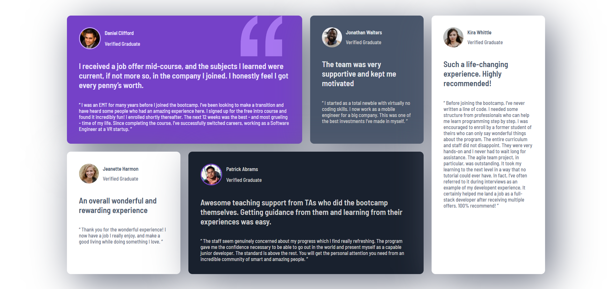

# 🎓 Testimonial Grid Practice1

A responsive testimonial layout built with **HTML** and **CSS** based on a UI design. This project is part of my practice to improve frontend layout skills using **CSS Grid** and **media queries**.

## 📸 Preview

### 💻 Desktop

### 📱 Mobile

## 🛠️ Technologies Used

- HTML5
- CSS3
- CSS Grid & Media Queries
- Custom Fonts

## 📱 Responsive Design

The layout adapts to different screen sizes:
- ✅ Desktop (4-column grid)
- ✅ Tablet
- ✅ Mobile (single-column)

## ✨ Features

- Reusable card components
- Font embedding via `@font-face`
- Clean and minimal UI
- Fully responsive

## 🧠 What I Learned

- How to structure HTML content semantically
- How to use `CSS Grid` effectively for layout
- How to make layouts responsive using `@media`
